# Final Project Code Files

**Comparative Analysis of Structural and Parametric Instability in Trajectory-Tracking Control: MOBY (Offset-Differential) vs. F1TENTH (Ackermann)**

Carolina Isabella Sánchez Cevallos · Jhony David Choez Lopez
Escuela Superior Politécnica del Litoral (ESPOL)

This repository contains all source code, simulation projects, configuration files, and validation evidence produced for the final project. The full written analysis (paper summary, technical critique, methodology, results, and discussion) is in **`FinalReport_G3.pdf`** at the repository root; this README covers only how to set up and run the code.

---

## 1. Repository Structure

```
Final-Project-Code-Files/
├── FinalReport_G3.pdf        ← full written report (read this first)
├── README.md                       ← this file
│
├── moby_sim/                       ← standalone Python package (no ROS2)
│   ├── model.py                    equations from Badia Torres et al. (2024)
│   ├── simulate.py                 time integration
│   ├── plots.py                    figure generation
│   ├── run_all.py                  reproduces all MOBY results/figures
│   ├── tests/test_model.py         automated validation suite
│   ├── outputs/                    generated figures + CSV (committed as evidence)
│   └── README.md                   package-level docs
│
├── f1tenth_sim/                    ← standalone Python package (no ROS2)
│   ├── model.py                    bicycle model + pure pursuit law
│   ├── path.py                     curvature-matched path generator
│   ├── simulate.py                 closed-loop kinematic simulation
│   ├── plots.py
│   ├── run_all.py                  reproduces all F1TENTH synthetic results
│   ├── tests/test_model.py         automated validation suite
│   ├── outputs/
│   └── README.md
│
├── src/                            ← real ROS2 packages (Humble)
│   ├── pure_pursuit/                the controller under study
│   ├── localization_bringup/        SLAM + AMCL bring-up
│   └── path_planning/               minimum-curvature raceline generator
│                        
├── pp_run_logger.py            records pose + /drive + lateral error to CSV during a real run
├── compare_pp_runs.py          plots multiple logged runs against the raceline
├── error_vs_curvature.py       correlates tracking error with local raceline curvature
│
└── docs/media/                     ← sample output images referenced by this README
```

---

## 2. Minimum Requirements to Run

There are **two independent code tracks** in this repository. You do **not** need ROS2 to run the standalone simulations.

### 2.1 Standalone simulations (`moby_sim/`, `f1tenth_sim/`, `tools/`)

| Requirement | Version used | Notes |
|---|---|---|
| OS | Any (Linux, macOS, WSL) | Developed/tested on Ubuntu 22.04 |
| Python | ≥ 3.8 | Tested on 3.10 |
| numpy | any recent | `pip install numpy` |
| matplotlib | any recent | `pip install matplotlib` |

Install everything with:
```bash
pip install numpy matplotlib
```
No GPU, no internet connection, and no ROS2 installation are required for `moby_sim/`, `f1tenth_sim/`, or `tools/`.

### 2.2 Real ROS2 pipeline (`src/pure_pursuit/`, `src/localization_bringup/`, `src/path_planning/`)

| Requirement | Version used | Notes |
|---|---|---|
| OS | **Ubuntu 22.04** | required by ROS2 Humble |
| ROS2 | **Humble Hawksbill** | `sudo apt install ros-humble-desktop` |
| colcon | latest | `sudo apt install python3-colcon-common-extensions` |
| f1tenth_gym_ros | latest | https://github.com/f1tenth/f1tenth_gym_ros |
| nav2 (incl. AMCL) | ROS2 Humble release | `sudo apt install ros-humble-navigation2 ros-humble-nav2-bringup` |
| slam_toolbox | ROS2 Humble release | `sudo apt install ros-humble-slam-toolbox` |
| Python packages inside ROS2 env | numpy, scipy | usually already satisfied by ROS2 Humble's Python 3.10 environment |
| RViz2 | ships with ROS2 desktop | for visualization only, not required for headless runs |

This entire pipeline is a full ROS2 workspace (`src/` above is meant to sit inside a workspace such as `~/roboracer-f1tenth/`, alongside `f1tenth_gym_ros` and other dependencies, not necessarily included in this repository). See each package's own `README.md` for exact build and launch commands; `src/pure_pursuit/README.md` in particular documents the complete runbook from a clean clone.

---

## 3. Setup and Execution Instructions

### 3.1 Standalone simulations — quick start

```bash
git clone https://github.com/carisanc/Final-Project-Code-Files.git
cd Final-Project-Code-Files
pip install numpy matplotlib

# MOBY: independent numerical reproduction of the push/pull instability
python3 -m moby_sim.run_all
# → writes moby_sim/outputs/*.png and *.csv

# F1TENTH: kinematic pure pursuit simulation on a curvature-varying path
python3 -m f1tenth_sim.run_all
# → writes f1tenth_sim/outputs/*.png and *.csv
```

Run the validation test suites first if you want to confirm the implementations behave as documented before trusting the figures:
```bash
python3 moby_sim/tests/test_model.py
python3 f1tenth_sim/tests/test_model.py
```
Both should print `All tests passed.` (see §6, Validation Results, below).

### 3.2 Real ROS2 pipeline — quick start

Full instructions (build, launch order, tunable parameters, and a complete troubleshooting log) are in `src/pure_pursuit/README.md`. Summary:

```bash
cd ~/roboracer-f1tenth        # your ROS2 workspace, with this repo's src/ packages inside it
colcon build --packages-select f1tenth_gym_ros localization_bringup path_planning pure_pursuit
source install/setup.bash     # repeat in every new terminal

# Terminal A — sim + AMCL + raceline + RViz, controller NOT yet moving:
ros2 launch pure_pursuit pure_pursuit_launch.py start_controller:=false

# Terminal B — once RViz is open and quiet, start the controller:
ros2 run pure_pursuit pure_pursuit_node --ros-args \
  --params-file install/pure_pursuit/share/pure_pursuit/config/pure_pursuit_params.yaml \
  -p csv_path:=install/path_planning/share/path_planning/racelines/saopaulo_gt.csv \
  -p pose_source:=tf -p speed_scale:=0.6
```

### 3.3 Analysis tools — logging and post-processing a real run

`tools/` scripts are standalone (no colcon build) and run alongside the ROS2 stack above:

```bash
# Terminal C — log a real run to CSV while the controller (3.2) is driving:
python3 tools/pp_run_logger.py \
  --csv_path install/path_planning/share/path_planning/racelines/saopaulo_gt.csv \
  --pose_source tf --out run_lk04_ss06.csv --run_label "lookahead_k=0.4, ss=0.6"
# Ctrl+C to stop logging; prints a mean/max/p95 error summary on exit.

# After logging 2-3 runs at different lookahead_k, compare them:
python3 tools/compare_pp_runs.py run_lk02_ss06.csv run_lk04_ss06.csv run_lk06_ss06.csv \
  --raceline install/path_planning/share/path_planning/racelines/saopaulo_gt.csv \
  --out real_pp_lookahead_comparison.png

# Correlate tracking error against the raceline's own curvature column:
python3 tools/error_vs_curvature.py run_lk02_ss06.csv run_lk04_ss06.csv run_lk06_ss06.csv \
  --raceline install/path_planning/share/path_planning/racelines/saopaulo_gt.csv \
  --out error_vs_curvature.png
```

---

## 4. Required Libraries / Dependency List

| Package/Tool | Used by | Install command |
|---|---|---|
| Python ≥ 3.8 | all | — |
| numpy | moby_sim, f1tenth_sim, tools | `pip install numpy` |
| matplotlib | moby_sim, f1tenth_sim, tools | `pip install matplotlib` |
| ROS2 Humble | src/* | `sudo apt install ros-humble-desktop` |
| colcon | src/* | `sudo apt install python3-colcon-common-extensions` |
| f1tenth_gym_ros | src/pure_pursuit, src/localization_bringup | https://github.com/f1tenth/f1tenth_gym_ros |
| nav2 / AMCL | src/localization_bringup | `sudo apt install ros-humble-navigation2 ros-humble-nav2-bringup` |
| slam_toolbox | src/localization_bringup | `sudo apt install ros-humble-slam-toolbox` |
| tf2_ros, rclpy, ackermann_msgs | src/pure_pursuit, tools | ships with ROS2 Humble desktop install |
| RViz2 | visualization only | ships with ROS2 Humble desktop install |

No dependency requires a specific hardware accelerator (GPU); the F1TENTH Gym simulator and all analysis scripts run on CPU.

---

## 5. Configuration Files

| File | Controls |
|---|---|
| `src/pure_pursuit/config/pure_pursuit_params.yaml` | look-ahead (`lookahead_k`, `lookahead_min/max`), wheelbase, max steering, pose source (`tf` vs `odom`), speed scale, control rate, nearest-point search window |
| `src/pure_pursuit/config/pure_pursuit.rviz` | RViz layout (map, raceline, car model, goal-point marker) |
| `src/pure_pursuit/launch/pure_pursuit_launch.py` | orchestrates the full stack (sim + AMCL + raceline publisher + controller + RViz); exposes `pose_source`, `speed_scale`, `lookahead_k`, `csv_path`, `map_yaml`, `start_controller` as launch arguments |
| `src/localization_bringup/` launch/config | AMCL "racing profile" parameters (motion-model alphas lowered from default 0.2 to 0.01) |
| `src/path_planning/config/raceline_params.yaml` | minimum-curvature optimization and friction-circle velocity-profile parameters used to generate `saopaulo_gt.csv` |

No configuration file is required to run `moby_sim/` or `f1tenth_sim/` — all parameters (d1, c, wheelbase, look-ahead values, etc.) are set as documented defaults directly in `run_all.py` in each package (see each package's own README for the exact values and how to override them).

---

## 6. Sample Output

### 6.1 MOBY — independent numerical verification

Reproducing the paper's push/pull instability and its compensation law (`python3 -m moby_sim.run_all`):

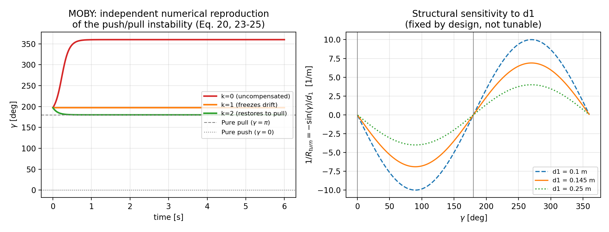
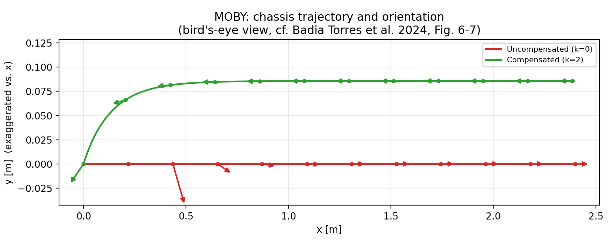

Terminal output of the actual run:

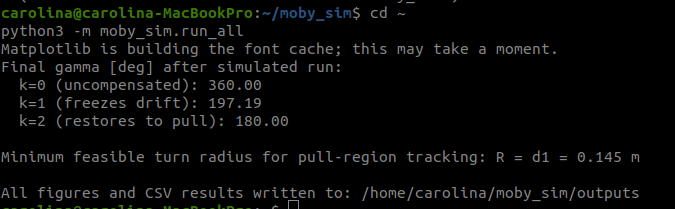

### 6.2 F1TENTH — synthetic curvature-varying simulation

`python3 -m f1tenth_sim.run_all`, path matching the curvature profile of MOBY's own test trajectory:

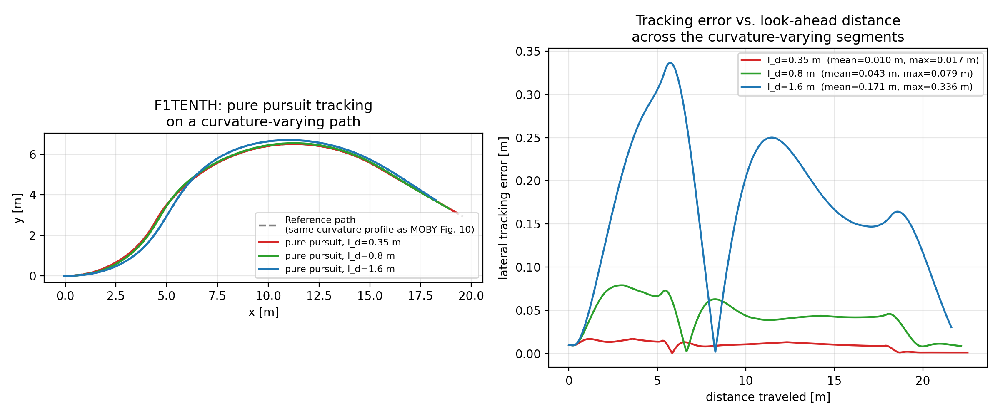
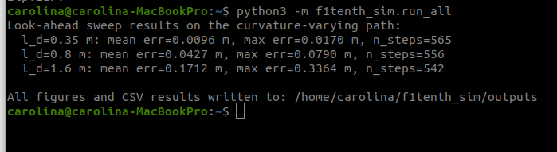

### 6.3 Real ROS2/Gym pipeline

SLAM map of the São Paulo circuit (`slam_toolbox`):

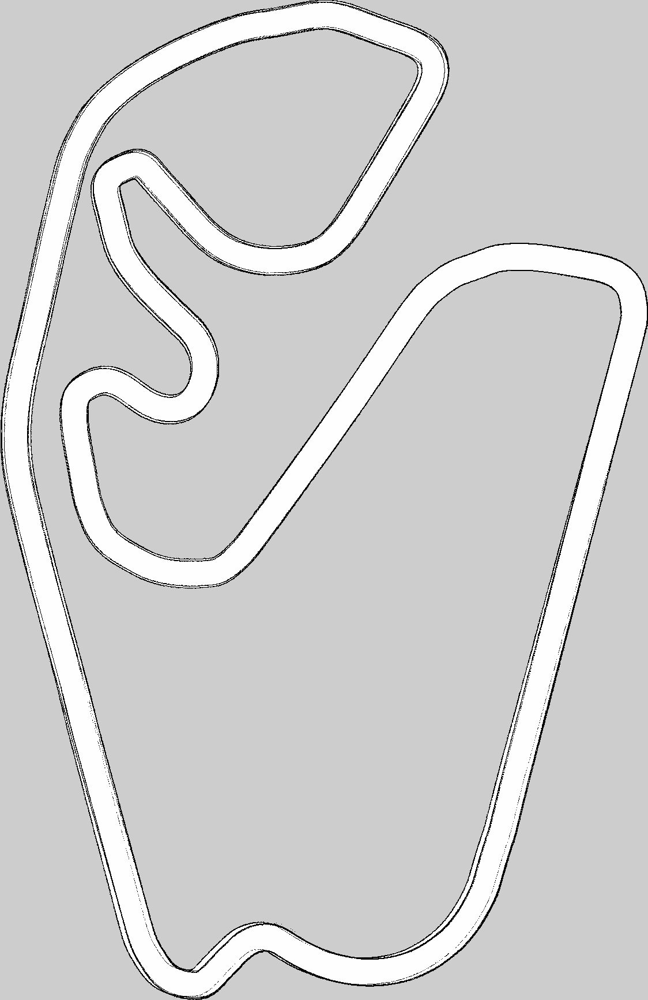

Minimum-curvature raceline and velocity profile (`path_planning`), with the generator's terminal output:

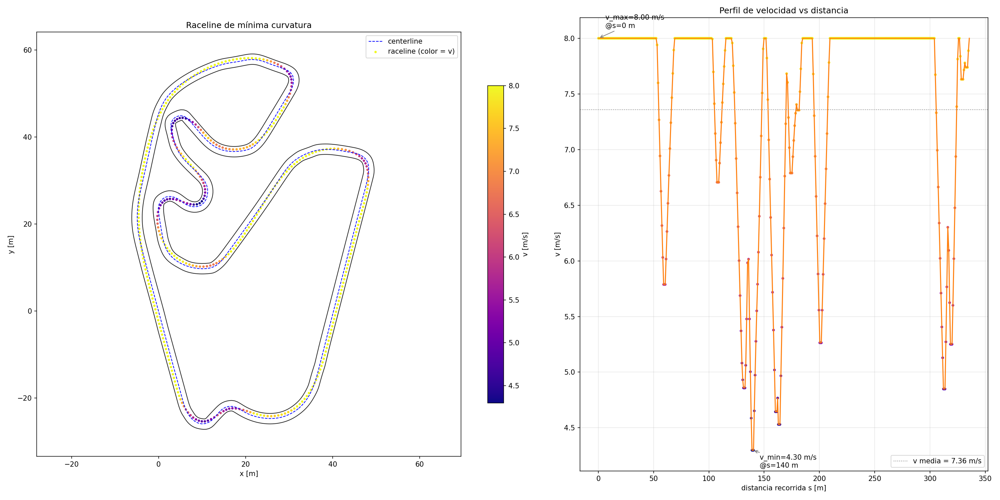
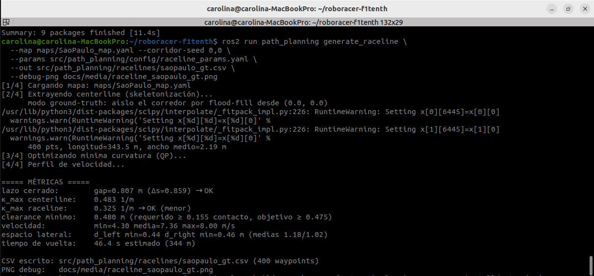

Raceline overlaid on the map in RViz:

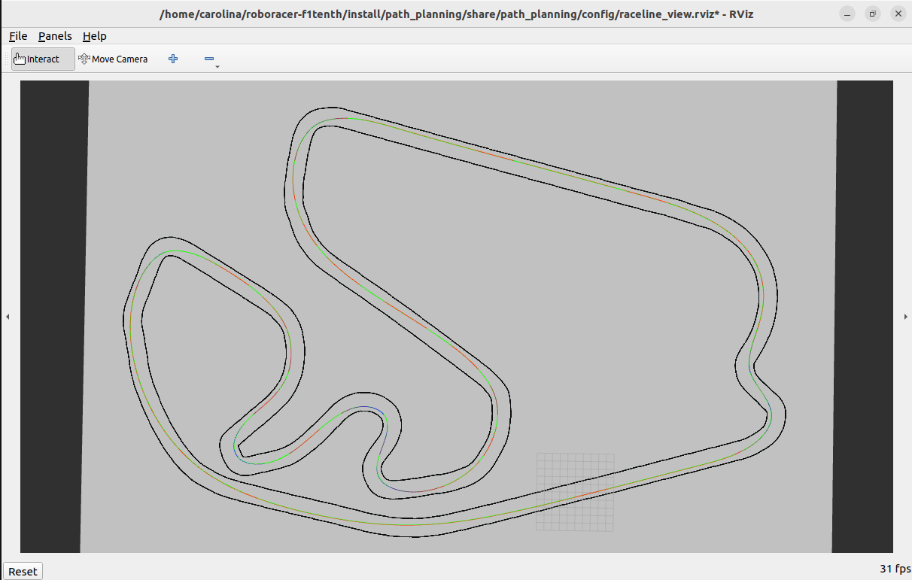

### 6.4 Real pure pursuit runs on the São Paulo circuit

Three real runs (`lookahead_k` = 0.2, 0.4, 0.6) logged with `tools/pp_run_logger.py` and compared with `tools/compare_pp_runs.py`:

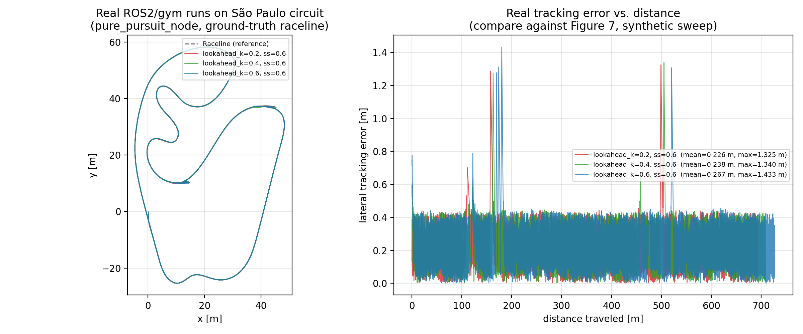

Tracking error correlated with local raceline curvature (`tools/error_vs_curvature.py`) — the empirical counterpart to MOBY's closed-form curvature-feasibility limit:

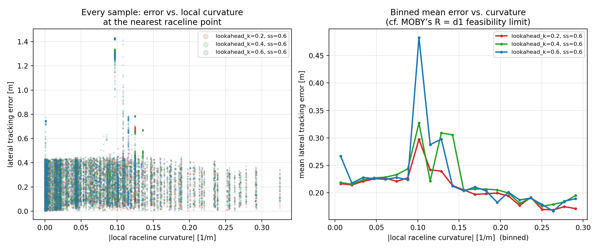

### 6.5 Overall pipeline

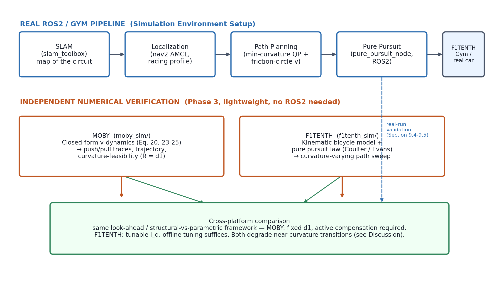

*(Full-resolution figures, additional runs, and video captures of the ROS2/gym simulation in action are referenced in Section 9 and Annex C of `Final_Review_Report.docx`.)*

---

## 7. Validation Results

Both standalone packages ship with an automated test suite that checks the implementation against the **qualitative or closed-form claims of the source literature**, not just against itself — i.e., each test encodes an independent, falsifiable prediction from the cited papers.

### 7.1 `moby_sim/tests/test_model.py` (4 tests)

| Test | Checks |
|---|---|
| `test_k0_diverges_to_push` | With no compensation (k=0), γ drifts away from the pull equilibrium toward push |
| `test_k1_freezes_drift` | With k=1, γ stops drifting near its starting disturbance without returning — the paper's documented special case |
| `test_k_greater_than_1_restores_to_pull` | With k>1, γ actively returns to the pull equilibrium (180°) |
| `test_higher_k_converges_faster` | Increasing k converges at least as fast, never slower |

Run: `python3 moby_sim/tests/test_model.py` → `All tests passed.`

### 7.2 `f1tenth_sim/tests/test_model.py` (4 tests)

| Test | Checks |
|---|---|
| `test_straight_ahead_goal_gives_zero_steering` | A goal point directly ahead (φ=0) commands zero steering angle |
| `test_curvature_matches_circle_for_small_lookahead` | Coulter's (1992) curvature formula matches a known circle's true curvature to within 1% |
| `test_steering_law_uses_half_coulter_curvature` | Numerically pins the ≈2× ratio between Coulter's (1992) and Evans et al.'s (2024) curvature definitions (a genuine literature discrepancy, not an implementation bug — see report §8.3/9.2) |
| `test_error_increases_with_lookahead` | Mean tracking error increases monotonically with look-ahead distance on the curvature-varying path |

Run: `python3 f1tenth_sim/tests/test_model.py` → `All tests passed.`

### 7.3 Real ROS2/gym pipeline validation

Validated independently of the standalone packages, on the actual simulator and circuit:

| Stage | Metric | Result |
|---|---|---|
| SLAM (`slam_toolbox`) | wall-thickness deformation | 0.55 m → 0.23 m after scan-matcher retune |
| Localization (`nav2 AMCL`, racing profile) | pose error in the hairpin | 2.24 m → 0.10 m after alpha retune (0.2 → 0.01) |
| Path planning (`path_planning`) | closed-loop gap | 0.807 m (within tolerance of 0.859 m average waypoint spacing) |
| Path planning | raceline max curvature vs. centerline | 0.325 1/m vs. 0.483 1/m (confirms the minimum-curvature optimization is working) |
| Pure pursuit (`pure_pursuit_node`) | real look-ahead sweep, mean lateral error | 0.226 m (k=0.2) → 0.238 m (k=0.4) → 0.267 m (k=0.6), monotonically increasing — matches the trend predicted by the synthetic `f1tenth_sim` simulation |

Full numerical results, the additional error-vs-curvature/speed correlation analysis, and the discussion of what these results mean are in Sections 9 and 10 of `Final_Review_Report.docx`.

---

## 8. Documentation Map

| Looking for... | Go to |
|---|---|
| The full paper critique, methodology, results, and discussion | `Final_Review_Report.docx` (repository root) |
| MOBY simulation theory, equations, and scope/limitations | `moby_sim/README.md` |
| F1TENTH standalone simulation theory and the Coulter/Evans curvature-formula note | `f1tenth_sim/README.md` |
| ROS2 pure pursuit controller: theory, full runbook, tuning table, and a running log of every bug found and fixed | `src/pure_pursuit/README.md` and `src/pure_pursuit/CLAUDE.md` |
| How the São Paulo map, localization, and raceline were built | `src/localization_bringup/`, `src/path_planning/` (see their own READMEs) |

---

## Notes on Code Comments

Every module in `moby_sim/` and `f1tenth_sim/` includes a file-level docstring citing the exact equation(s) or formula(s) implemented, plus inline comments on any place the implementation deviates from, simplifies, or extends the source literature (for example, the single-angle reformulation of MOBY's compensation law, and the documented factor-of-two discrepancy between the two pure-pursuit curvature formulas). `src/pure_pursuit/pure_pursuit_node.py` documents its control loop step by step in its header comment, mirrored in `Final_Review_Report.docx`, Figure 8.3. `src/pure_pursuit/CLAUDE.md` additionally keeps a dated, problem→cause→fix log of every non-trivial debugging session on the real ROS2 stack.
